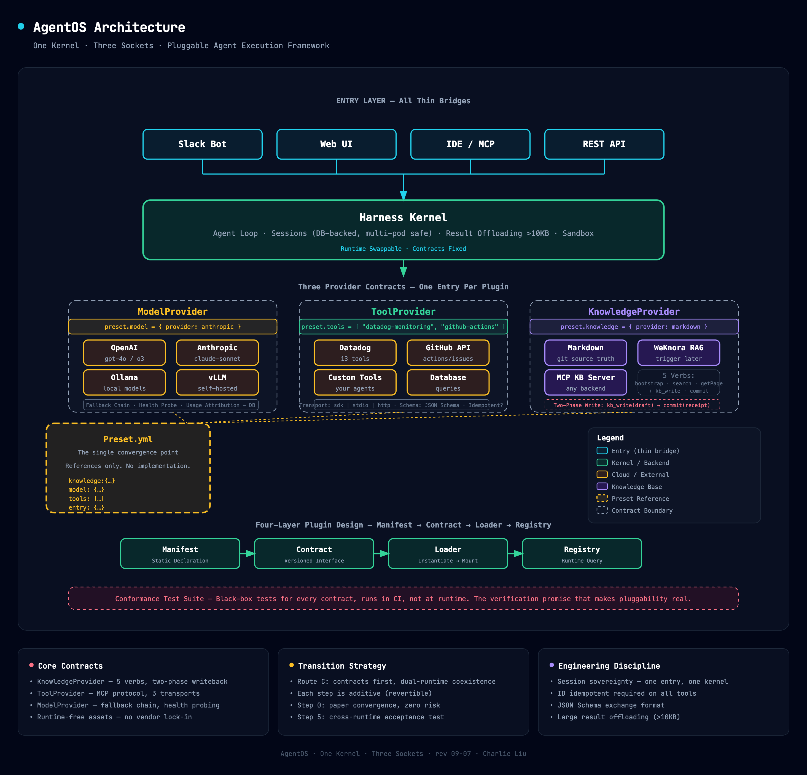

# AgentOS

> **One kernel. Three sockets.**

AgentOS is a **pluggable Agent execution framework**: one Harness kernel for the agent loop, session management, and sandboxing; three Provider contracts (Model / Tool / Knowledge) that can be swapped at any time — **switch your stack by editing one preset file, zero code changes required**.

[Chinese docs](README_zh-CN.md) · [Design docs](.docs/)

---

## Table of Contents

- [Core Claims](#core-claims)
- [Architecture Overview](#architecture-overview)
- [The Three Contracts](#the-three-contracts)
- [Four-Layer Plugin Design](#four-layer-plugin-design)
- [Knowledge Base](#knowledge-base)
- [Transition Strategy](#transition-strategy)
- [Engineering Discipline](#engineering-discipline)
- [Quick Start](#quick-start)
- [Decision Log](#decision-log)
- [Open Decisions](#open-decisions)

---

## Core Claims

| # | Claim |
|---|-------|
| 1 | **Contracts stay, host swaps** — The same interface set can connect to different Agent runtimes |
| 2 | **The sockets already exist, just implicit** — Model routing, tool registries, and knowledge injection are scattered across existing frameworks; they can converge into explicit contracts |
| 3 | **"Switch business = switch preset" is the differentiator** — One preset file references all providers, writes no implementation |

---

## Architecture Overview



*Interactive HTML version with export options (PNG/PDF): [.docs/architecture-diagram.html](.docs/architecture-diagram.html)*

**Tenant model:** One business = one preset file (provider selection + workspaceId + tokenEnv). Credentials never enter the manifest — only env-var references.

---

## The Three Contracts

### KnowledgeProvider — Pluggable knowledge base

Session injection → retrieval → two-phase write-back (`kb_write` draft / `kb_commit` persistent)

```ts
interface KnowledgeProvider {
  bootstrap(preset): DirectoryIndex        // Guide: directory + recent updates
  search(q, limit): SearchHit[]            // Keyword / semantic search
  getPage(id): PageContent                 // Read original content
  listPages(scope): IndexEntry[]           // Index listing
  writePage(draft): Receipt                // Two-phase: draft only
  commit(receipt): void                    // Persist after confirmation
}
```

| Implementation | Status | Notes |
|----------------|--------|-------|
| `provider-markdown` | v0.1 available | Zero-dependency fallback; git+markdown as source of truth |
| `provider-weknora` | Post-trigger | RAG + Wiki UI + multi-tenant (activated at hundreds-of-pages scale) |
| `provider-mcp` | Planned | Any KB server via MCP protocol |

### ToolProvider — MCP pluggability

One tool server = one declarative registry entry, mounted at runtime by transport.

```yaml
# tool-entry.yaml
name: datadog-monitoring
transport: stdio          # sdk | stdio | http
auth: token-env:DATADOG_TOKEN
allowedTools: ["dd_*"]
envRouting: non-prod      # non-prod | prod
idempotent: true          # required - determines retry safety
schemaExchange: json-schema
```

**Mount rules:** Mounted individually; a single failure = absent + alert, never drags down the whole system. Startup drift check (declared vs actually discovered tools).

### ModelProvider — Model pluggability

Three-tier priority routing (request override → channel/tenant config → global default), with fallback chain.

```ts
interface ModelProvider {
  provider: 'openai' | 'anthropic' | 'ollama' | 'local'
  models: Record<string, string>       // aliases (sonnet/haiku…) → real model id
  fallbackChain: string[]              // health-probe short-circuit
  usageAttr: { provider, model, tenant } // usage attribution labels
  // routing state ∈ DB (multi-pod safe)
}
```

---

## Four-Layer Plugin Design

Knowledge, model, MCP tools, entry — four layers that **share one quad tuple**, not separate mechanisms for each:

```
Manifest (static declaration) → Contract (versioned interface) → Loader (instantiate → mount) → Registry (runtime query)
```

The preset is the single convergence point for all four layers: it only **references** providers, never implements them.

```yaml
# preset-example.yml — one per business; switching business = changing this file
knowledge: { provider: weknora, workspaceId: w-123, tokenEnv: WEKNORA_TOKEN }
model:      { provider: anthropic, policy: default }
tools:      [ datadog-monitoring, github-actions ]
entry:      { slack: { channel: "#engineering", confirmUI: blockkit } }
# Credentials never enter manifest, only tokenEnv reference
```

### EntryAdapter — Entry layer (add last, not first)

An entry plugin ≠ one per client type. Instead, extract only four cross-layer translations:

| Method | Responsibility |
|--------|---------------|
| `identity()` | Credential → `{ userId, tenant }` (API key / OAuth / Slack mapping) |
| `session()` | Client session ↔ agent session mapping |
| `render()` | SSE event stream → client presentation (passthrough / Block Kit / text) |
| `confirm()` | Confirmation capability declaration (decides knowledge write permission) |

### Conformance Test Suite

Each contract ships with a set of black-box tests that every implementation must pass, running in CI — not at runtime. With it, pluggability becomes a verifiable promise rather than an architecture aesthetic. It also serves as the sole onboarding guide for future third-party implementers.

### Implementation Order

| Step | What | Acceptance | Why here |
|------|------|------------|----------|
| 0 | Manifest meta schema + four contracts (text only) | Each contract describes a real existing system | Paper convergence, zero risk |
| 1 | Convert existing project's MCP registry to manifest-driven | Zero difference in tool set before/after | Reference exists, mechanism easiest to see |
| 2 | Introduce a second project as the first external manifestonboard | Idempotent declarations work, non-idempotent tools protected | Immediately pressure-tested by a second real consumer |
| 3 | Extract two ModelProvider implementations (e.g., OpenAI / Ollama) | Swap providers within a single request, routing works | Pure extraction, mechanism widely proven |
| 4 | Two EntryAdapter implementations: Slack + REST | Same preset runs the same conversation from both ends | Two-implementation principle → contract finalization |
| 5 | knowledge-core + multiple providers + cross-runtime conformance | Same preset passes full flow in two different runtimes | Depends on steps 1–4 format stability |

### Three Anti-patterns (Rejected)

| # | Anti-pattern | Status | Alternative |
|---|-------------|--------|-------------|
| ① | Invent a custom tool protocol | Rejected | Use MCP directly for tools — only handle mounting, not definition |
| ② | Hot-swap before startup loading | Rejected | First step: "read manifest at startup"; runtime hot-plug is the last milestone |
| ③ | One entry, two kernels | **Set on day one** | channel → (kernel, preset) routing table; forbid two kernels listening to the same thread |

---

## Knowledge Base

### Seven Channels of Knowledge Injection

| # | Channel | Knowledge Type | Triggered By | Cost Model | Put Here |
|---|---------|---------------|--------------|------------|----------|
| 1 | System prompt | Rules | Code assembly | Every-turn paid | Minimal + always needed (HARD RULES) |
| 2 | CLAUDE.md layered memory | Project knowledge | Auto-loaded | Startup-resident | Small + stable + team-wide essential |
| 3 | Skills | Procedural knowledge | Menu-resident, model reads body | Menu tax + one-time fetch | SOPs / operating procedures |
| 4 | MCP tools | Dynamic facts | Model decides to call | On-demand, persists to disk | Lookups (monitoring systems, API queries) |
| 5 | Workspace files | **Static repository** | Read/Grep | **Zero protocol cost** | **Tens~hundreds of md docs + index + writeback drafts — primary battlefield** |

> Generic Agent frameworks have no built-in RAG — large fact repositories require combining channels 4 and 5 yourself.

### Scale Sweet Spot: Tens to Hundreds of Files Need No Vector Retrieval

Full-index summary ≈ 1–2K tokens; a complete directory menu resident in context resolves search questions instantly. Read body on demand via Grep (string matching has higher precision than semantic search for internal docs). Four triggers for adding aretrievallayer: >150 pages / systematic rewrite gap appears / non-git audience / cross-tenant sharing — activate any two before proceeding.

### Evolution Ladder and Slot Adjudication

| Slot | Candidates Here | Verdict |
|------|----------------|---------|
| Source of truth (library) | **git + markdown** | No software dependency, load-bearing wall, not moving |
| Edit/Browse (person's desk) | VSCode / Typora / Obsidian | Can coexist with git repo, not a replacement |
| Index/Search (research lab brain) | LangChain RAG / LlamaIndex / pgvector | Pure algorithms, no product form; don't touch at hundreds-of-pages scale |
| All-in-one platform | Dify KB / RAGFlow / Outline | Fair comparison post-trigger, license compliance first |

### Connection Chain: How harness "sees" the knowledge base

```
git + markdown repo (source of truth · the book)
  ↓ One-way ingest · reindex.sh replayable
Knowledge engine (index layer · book cover: chunks + vector + Wiki UI)
  ↑ Dialect stops at this layer
provider-<engine> (thin shell · the only real glue: governance + tenant + credentials)
  ↓ Speaks Mandarin: MCP
kb-mcp-server (kb_search · kb_get_page · kb_append)
  ↓ MCP protocol · anyone can plug in
LangGraph · CrewAI · AutoGen · Custom frameworks
```

**Why:** Dialect isolation (engine details don't leave the shell) · Governance in the shell (two-phase writeback, pending-exclusion, >10KB offloading) · Write once, four runtimes eat (one implementation serves all frameworks)

---

## Transition Strategy

Three approaches, **Route C recommended**:

| Route | Kernel | Action | Verdict |
|-------|--------|--------|---------|
| A | One specific runtime | Plugin everything onto a single framework | Observe: long-context engineering not reproducible short-term |
| B | Another runtime | Deep customization | Second choice: bound to upstream release cadence |
| **C** | **Contracts first · Multi-runtime coexistence** | **Contract finalization, each runtime implements independently, capabilities gradually onboard** | **Recommended** |

### Route C · Four Steps (Each Revertible)

1. **Finalize the three contracts** — Only contracts and schemas, runtime-free assets
2. **Introduce the first external ToolProvider** — Validate the provider-mcp path
3. **Add a knowledge entry to an existing system** — Supplement business knowledge without touching the original kernel
4. **Cross-runtime acceptance test** — Same preset, different runtimes, each passing inject→retrieve→writeback

> "Each revertible" = every step is an addition (new contract doc, new manifest entry, new adapter impl). No modification or deletion of live systems. Revert = remove that step's additions.

---

## Engineering Discipline

| # | Discipline | Level | Note |
|---|-----------|-------|------|
| 1 | **Session sovereignty**: one entry belongs to one kernel | High | Dual-kernel hijack session = split context, status mismatch |
| 2 | **Schema exchange via JSON Schema** | Medium | Incompatible schema versions silently drop all tools |
| 3 | **idempotent required** | Medium | Non-idempotent tools under auto-retry execute irreversible operations |
| 4 | **Registry configuration-driven** | Discipline | Module-level state forbidden in multi-pod |
| 5 | **Large result governance in contract** | Discipline | >10KB results offload, return pointer only |

---

## Quick Start

### Requirements

- Node.js ≥ 20
- TypeScript ≥ 5.4

### Install

```bash
git clone https://github.com/charlie-bit/agentos.git
cd agentos
npm install
```

### Development

```bash
# Run tests
npm test

# Type check
npm run typecheck
```

### Contributing

See [CONTRIBUTING.md](./skills/CONTRIBUTING.md).
